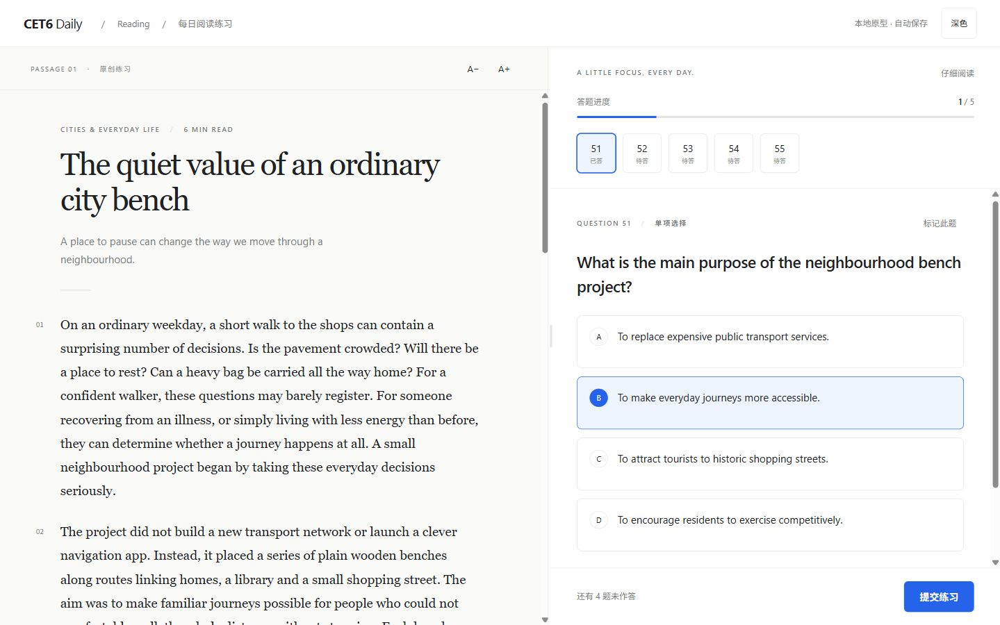
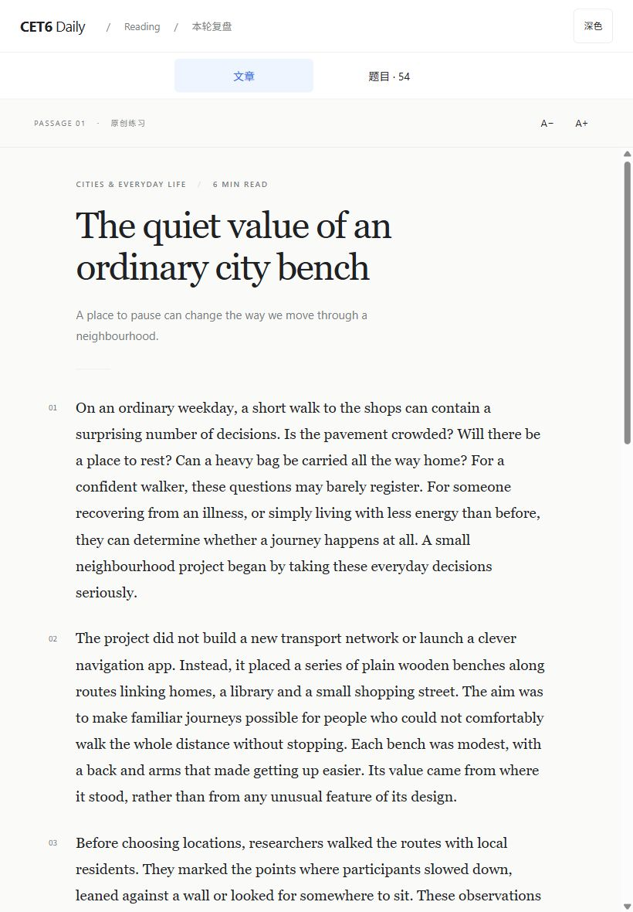
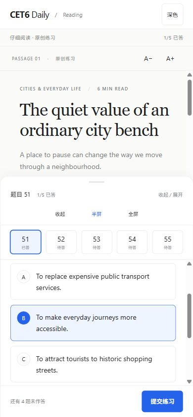
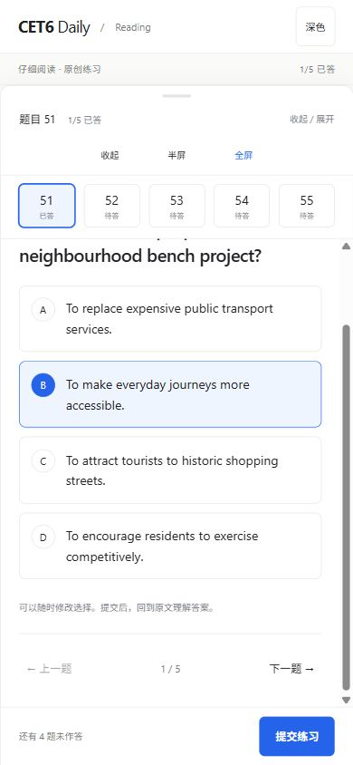
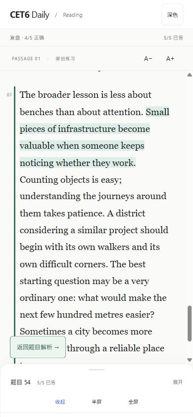
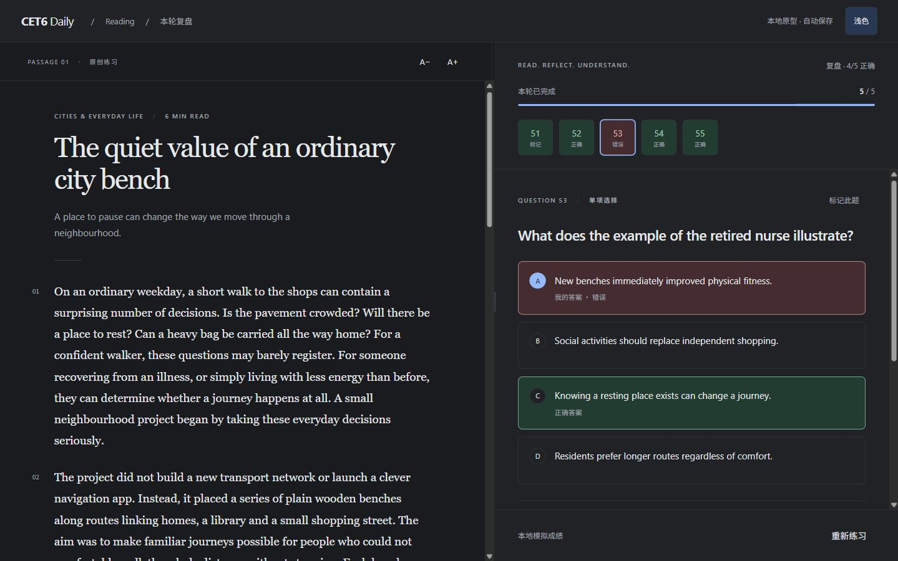
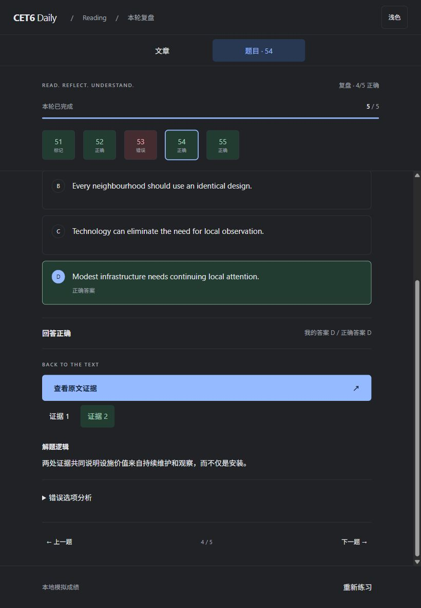

# Reading workspace delivery

## Run and entry points

Branch: `feat/cet6-reading-ui-prototype`. Node 22+.

```sh
npm ci
npm run dev -- --port 5174 --strictPort
```

Open http://127.0.0.1:5174/playground/reading. This route needs no API or Neon credentials. Vite parses the original Markdown fixture at configuration/build time. Generated TypeScript is checked in so `typecheck` also works in a fresh checkout. Do not edit generated files.

An opt-in formal entry is `/reading/<existing-session-uuid>`; the old desktop careful-reading header links to it. It requires the normal authenticated same-origin API. The default practice entry and matching/cloze UI remain intact. No deployment was requested or performed.

## Repository findings

Existing React 19 + TypeScript, Vite 7, Tailwind 4, plain CSS, Hono Workers, Neon serverless/Drizzle, Zod, manifest and service worker were retained. There is no router or component framework to replace: path dispatch extends `src/main.tsx`. No dependencies were added.

`scripts/bank.ts` reads Markdown metadata and the source bank's paired structured JSON. It validates provenance, answer documents and release status. It is not a generic Markdown-body parser. Existing imported paragraph IDs and all source text remain unchanged. Its current normalization emits no explanations. The repository's release contract reports no approved real groups; this run did not query production Neon to independently refresh coverage.

## Components and state

- `ReadingWorkspace`: shared responsive shell, desktop 55/45 split (40–65% range), keyboard arrows/Home and double-click reset; independent scroll containers.
- `PassageReader`: memoized article, 17–26px font control (19px default), stable paragraph IDs, selection toolbar, cross-paragraph highlights and exact evidence ranges.
- `QuestionPanel`, `QuestionOption`: native radio semantics, arrow keys, answer edits without grading, current question only.
- `QuestionNavigator`, `QuestionProgress`: current/answered/flagged/correct/wrong/unanswered text states.
- `ReadingReviewPanel`, `EvidenceLink`: locked answers, exact paragraph/sentence jumps, multiple evidence buttons, on-demand distractors and explicit missing-evidence message.
- `FormalReading`: adapter to the existing authentication, sessions, draft persistence, submission and results.

Desktop starts at 1024px. Tablet widths 600–1023 use mounted article/question panels with tabs. Below 600px, a bottom drawer has collapsed/half/full states, pointer capture and 44px button alternatives. Half height is 65% of the workspace; the question body scrolls independently while submit stays visible. Safe-area padding and reduced-motion rules apply.

The versioned prototype key `cet6:prototype:reading:quiet-city-v1` stores passage/current question, answers, flags, article and per-question scroll, drawer, highlights, practice/review status, evidence selection, split, tablet tab, theme and font size. Zod validates persisted state. Corrupted/foreign drafts are ignored and invalid highlight ranges are filtered. Failed local storage produces a visible warning. Restarting the mock round retains article/highlight/preferences and clears answers/flags.

User highlights are paragraph/offset ranges rendered by React; no `innerHTML` mutation. Personal and evidence layers use different state/colors and can overlap. Removing a selected highlight removes intersecting saved highlight ranges. The prototype's mock review module is dynamically requested after submission; its answers are intentionally inspectable demo assets, never a security mechanism for real bank answers.

## Business integration and boundaries

Formal data comes from `GET /api/me`, `GET /api/sessions/:id`, and `GET /api/sessions/:id/result` after submission. Choices/flags/cursor/article scroll use existing `useDraft`, including local pending drafts, cloud revisions, retries and conflict resolution. `useDraft` now accepts an optional enabled flag so completed sessions stop timing and flushing. The existing callers keep their default behavior.

Submission reuses `PATCH /api/sessions/:id` followed by `POST /api/sessions/:id/submit`, with the existing stable submission UUID and revision. Grading stays in the server's atomic `cet6_submit` function. Result review uses only server-returned answers and exact evidence. Retrying creates a normal `practice_type: retry` session. Statistics continue to read existing attempts; no new counters or tables.

The mock entry never invokes business APIs. The formal entry never invokes the mock grading path. Formal UI preferences/highlights are local and scoped to user/session; existing annotation tables are not repurposed. No database migrations, original bank edits, imports, production writes or credential changes.

Production recheck (2026-10-09): 248 eligible groups and 1,860 questions are already released; verified explanations remain 0. Source bank validation passed with 248 release-ready groups and no quarantined groups. No production import was needed. Exact evidence remains unavailable for those real questions, and the UI explicitly reports that limitation. Remaining integration gaps: verified evidence/analysis coverage and real authenticated Neon/device end-to-end acceptance. New personal highlight ranges are local only and do not sync across devices. Matching/cloze retain the old supported workspace and are not implemented in the new single-choice adapter.

## Validation (2026-10-09)

- `npm run typecheck`: passed.
- `npm test`: 5 files / 27 tests passed, including 6 new fixture/persistence tests. Existing API coverage includes answer privacy, stale draft rejection, immutable history, rollback and duplicate-submit idempotency.
- `npm run build`: passed; Vite client and Worker bundle dry-run succeeded. Zod dependency PURE-comment notices are non-fatal.
- Actual in-app Chromium interactions: changed an answer, jumped/skipped/flagged questions, cancelled an incomplete submission, submitted all five (4/5 correct), reviewed correct/wrong answers, expanded distractors, jumped to single and multiple exact evidence, checked missing evidence, restarted a round, restored after refresh.
- Article scroll was measured as `844.3697` before and after answer changes and after refresh. Drawer and selected B also restored. Text highlight survived switching questions/views and reload, then was removed through its toolbar.
- Split pointer drag measured 62.5%, then double-click reset to 55%; keyboard right measured 56%. Drawer pointer drag moved collapsed → half without an extra click transition.
- Formal adapter on the existing isolated PGlite test HTTP server: one answer + four unanswered submitted, 1/5 returned by server, exact evidence displayed, dashboard showed 5 attempts and 20% first accuracy. This is not production Neon evidence.
- Actual screenshots checked: desktop 1440×900, iPad 820×1180, iPhone 390×844, plus 320×720 overflow check. Light/dark states, full/half/collapsed drawer and evidence view inspected.
- Console: development HMR originally reported duplicate `createRoot` after editing the entry module; root reuse was fixed. Fresh-page console checked after the fix. No production-console claim is made.

The existing Playwright E2E suite was not run in this turn; actual new-page interactions used the in-app browser. No physical iOS/Safari, OS font enlargement, offline reload, clipboard permission-denial or screen-reader-device test was performed. The browser's raw touch injection is unavailable, so pointer dragging and accessible buttons were verified rather than claiming physical touch proof.

## References consulted

Mechanisms only, no copied source code, exam passages, graphics or business logic:

- [IELTS Study](https://github.com/iFralex/IELTS-Study): split-pane reading and persisted practice context.
- [IELTS Academic Practice Platform](https://github.com/lincohlesteban-art/ielts-academic-platform): draggable divider and annotation toolbar.
- [IELTS on Computer](https://github.com/aknahin/ielts-on-computer): answered navigation, flags, text selection and local practice.
- [Readest](https://github.com/readest/readest): typography/theme controls and focus on reading; README retrieved through its official raw GitHub source when repository rendering failed.
- [IELTS Atlas / IELTS-practice](https://github.com/sallowayma-git/IELTS-practice): practice and review workflow reference.

## Actual screenshots








